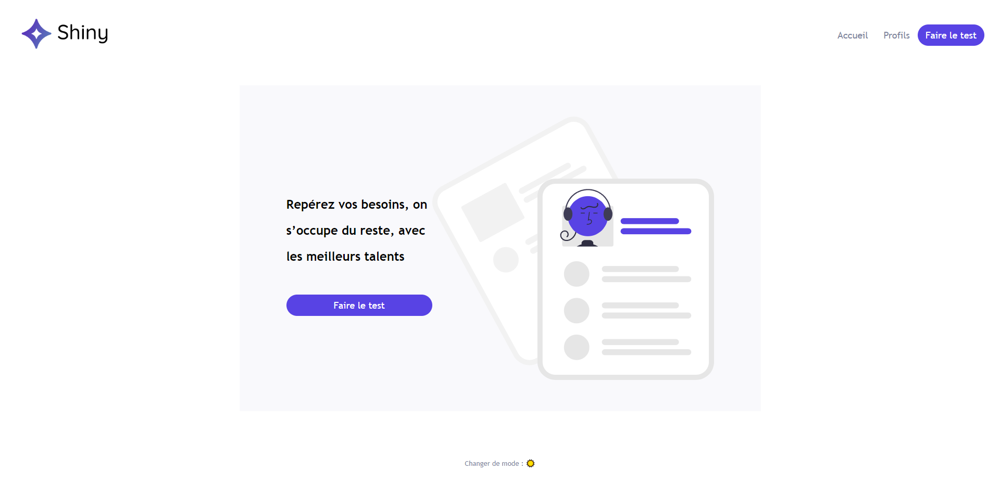
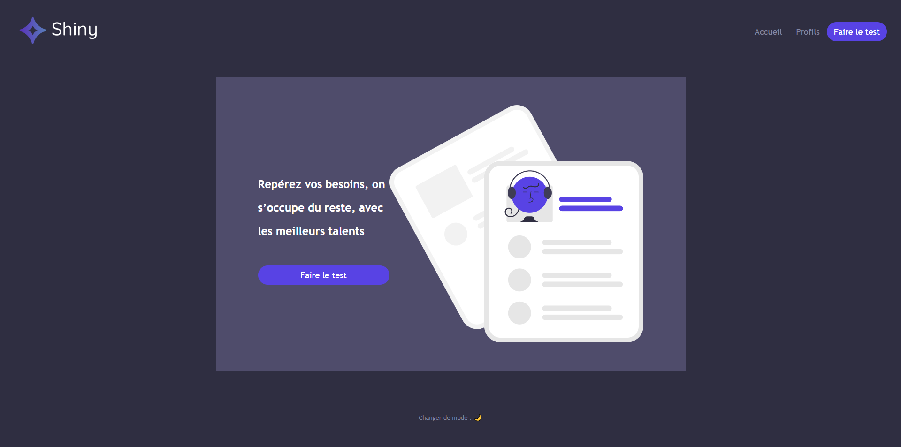

# Shiny Agency Single Page Application

## API nécessaire pour ce projet

[Lien de l'API](https://github.com/OpenClassrooms-Student-Center/7150606-API-React-intermediaire)

## Scripts

In the project directory, you can run:

### Pour démarrer l'application :

export NODE_OPTIONS=--openssl-legacy-provider
yarn start

### Lancer les tests :

yarn run test

## Homepage preview :

## Dark Mode preview :

